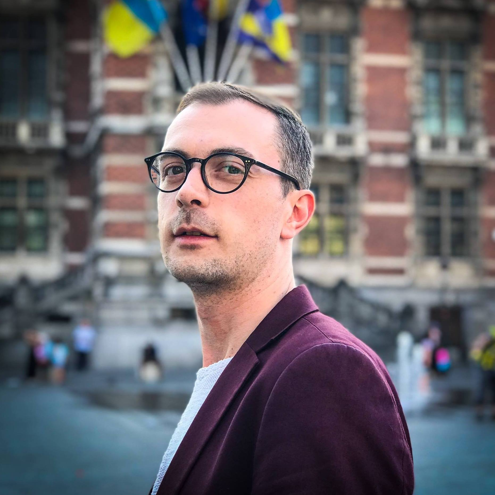

# Yoann Stas
*"Train insane or remain the same"*

## 35 Years old Graphic Designer & Art Director from Brussels trying to learn coding at becode.org

| birthday | Gender| Favourite colour |favourite food | Pineapple on pizza
|---|---|---|---|---| 
| 12/02 | Male | Royal Blue |Italian |  <ul><li>[x] No Way</li><li>[ ] Heck Yes</li></ul>

### Hobbies 
* Music
  * Italo
  * Balearic beats
  * 80's
  * Deephouse
* Politics
* My Cat 
  * Feeding her
  * Petting her
  * Punishing her!!

### you can always count on me when...
you need some advice and help with all what breaths Adobe CC, Powerpoint, Keynote, etc

### A funny story
A few years ago I went to New York with my best friend. What a great diverse city that is. We clearly saw that when we got invites for a cool rooftop party full of fashionably and hip people. We were so amazed by the party that we decided to go back to that club the night after. Looks like this wasn't a good idea since we actually ended up strumbling on a night full of naked men - you get the picture right? 

#####  TL;DR
One party is clearly not the other party!

[WALIMINATI](https://www.google.com) - YOANN - [YUNES](https://www.google.com)
